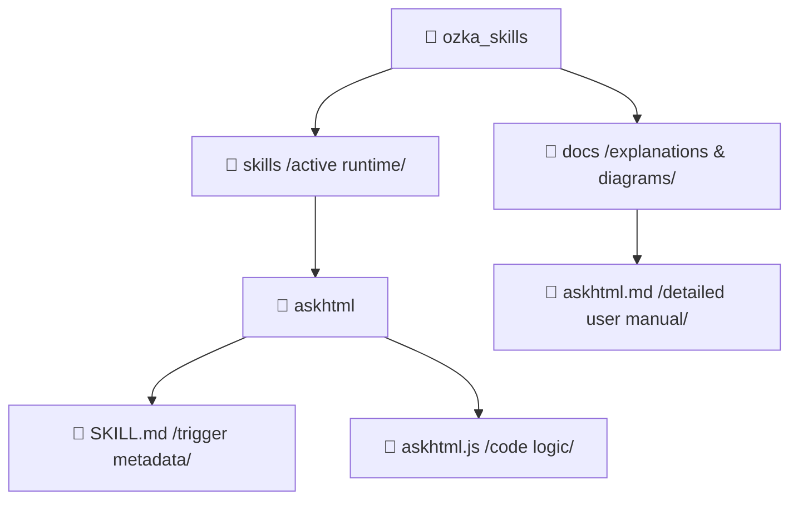

# 🌌 Ozka Custom Agent Skills Library

  
  
  

Welcome to the **Ozka Custom Agent Skills Library**! This repository is a premium, open-source workspace designed to store, manage, and document custom-built agent skills. 

The structure is optimized for **infinite scaling**, allowing you to add hundreds of custom skills while keeping code runtimes clean and documentation comprehensive.

---

## 📐 Project Architecture

To ensure speed and neatness, code execution files are kept isolated from verbose user documentation:

---

## ⚡ Skill Inventory

Below is a summary of all custom skills currently available in this library. Click on the links to explore the code or read the detailed explanation manuals.

| Skill | Trigger / Command | Problems Solved | Code | Explanation |
| :--- | :--- | :--- | :--- | :--- |
| **AskHTML** | `[prompt] /askhtml` | Turns generic AI chat prompts into beautiful interactive HTML forms, streamlining data collection with structured JSON outputs. | [Code Directory](file:///Users/oka/Documents/work/ozka_skills/skills/askhtml) | [Detail Manual](file:///Users/oka/Documents/work/ozka_skills/docs/askhtml.md) |

---

## 🛠️ Adding Your Own Skills

Adding a new skill is extremely easy. The repository is configured to hold hundreds of personalized skills.

For detailed guidelines on folders, naming conventions, and template requirements, please refer to the [Contributing Guide](file:///Users/oka/Documents/work/ozka_skills/CONTRIBUTING.md).

---

## ⚖️ License

This project is licensed under the MIT License. See the [LICENSE](file:///Users/oka/Documents/work/ozka_skills/LICENSE) file for details.
