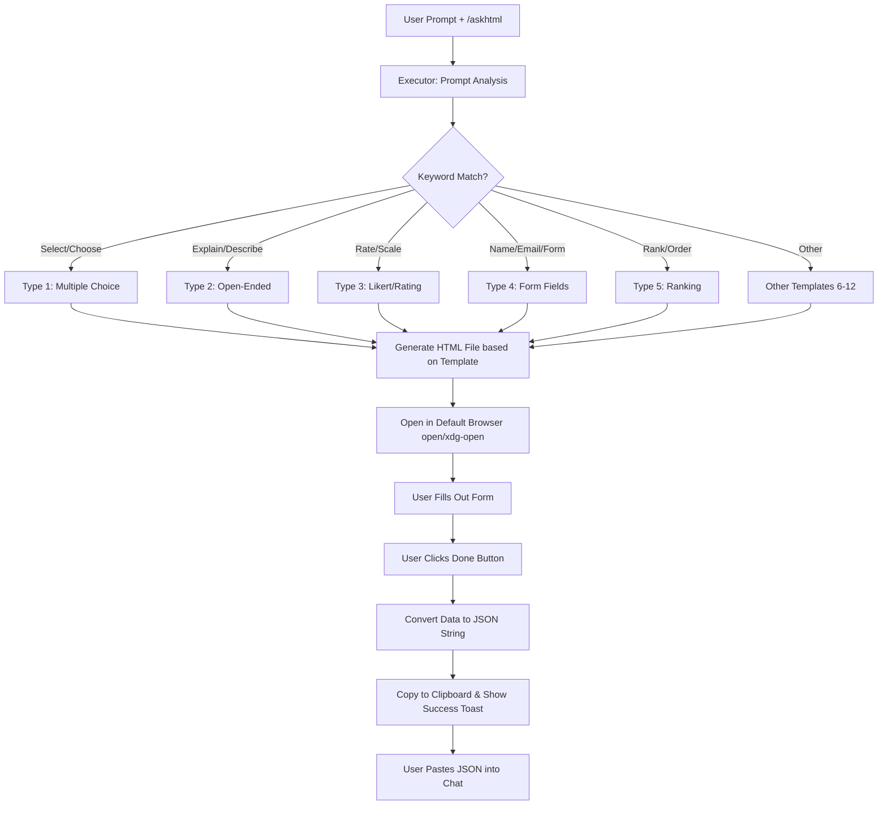

# 📋 AskHTML Detailed Documentation & User Manual

The `askhtml` skill is designed to completely transform and accelerate how you gather structured data during AI agent interactions.

---

## 🎯 Purpose & Solved Problems

When working with LLMs, filling out large lists of choices, ratings, surveys, or complex form data can be incredibly tedious. Typing everything directly into the chat bar is slow, error-prone, and often misunderstood by the model.

**How AskHTML solves this:**
- Temporarily transforms the conversation into a **visual web form**.
- Delivers an error-free, rapid, and fluid data entry experience.
- Produces a clean **JSON** output that is automatically copied to your clipboard when the form is submitted.
- Ensures structured, machine-readable inputs that the agent can immediately process.

---

## 📊 Comparison: Standard Chat Input vs. AskHTML

| Feature | Standard Chat Input | AskHTML Experience |
| :--- | :--- | :--- |
| **Input Speed** | Slow (requires typing everything manually) | Extremely Fast (clicks, scrolls, and selections) |
| **Error Rate** | High (typos, formatting errors, omissions) | Zero (HTML form validations and structured schemas) |
| **Data Structure** | Plain text (requires parsing by the AI) | Direct structured JSON payload |
| **Large Selection Sets** | Impractical to select from e.g., 50 options | Done in seconds using search and multi-select grids |
| **User Interface** | Monotonous chat input box | AMOLED-black, premium, responsive mobile-friendly UI |

---

## 🗺️ How it Works (Workflow Diagram)

The flowchart below displays the step-by-step process from triggering the skill to retrieving the JSON payload:



---

## 🛠️ Supported Form Types & JSON Schemas

The system automatically detects **12 different question types** based on prompt context:

### 1. Multiple Choice
- **Keywords:** `choose`, `select`, `pick`, `option`, `list of`
- **Output Schema:**
  ```json
  {
    "selection": ["option_0", "option_2"]
  }
  ```

### 2. Open-Ended
- **Keywords:** `describe`, `explain`, `tell me`, `opinion`
- **Output Schema:**
  ```json
  {
    "response": "Detailed text feedback from the user goes here..."
  }
  ```

### 3. Likert / Rating
- **Keywords:** `rate`, `rating`, `satisfaction`, `1-5`, `scale`
- **Output Schema:**
  ```json
  {
    "rating": 4
  }
  ```

### 4. Form Fields
- **Keywords:** `name`, `email`, `phone`, `collect`, `contact`
- **Output Schema:**
  ```json
  {
    "name": "John Doe",
    "email": "john.doe@example.com",
    "message": "Hello!"
  }
  ```

---

## 💡 Tips & Best Practices

1. **Pop-up Blockers:** The form will automatically open in a new tab in your default browser. If it doesn't open, verify your browser's pop-up settings or manually open the path (`/tmp/askhtml_form_*.html`) printed in your terminal.
2. **Keyboard Navigation:** The forms fully comply with accessibility standards. You can use the `Tab` key to navigate between form fields, make selections, and press Enter to copy/submit.
3. **Resubmission:** If you made a mistake on a form, you don't need to close the tab. Simply correct the information and click the **Done** button again to update your clipboard.
