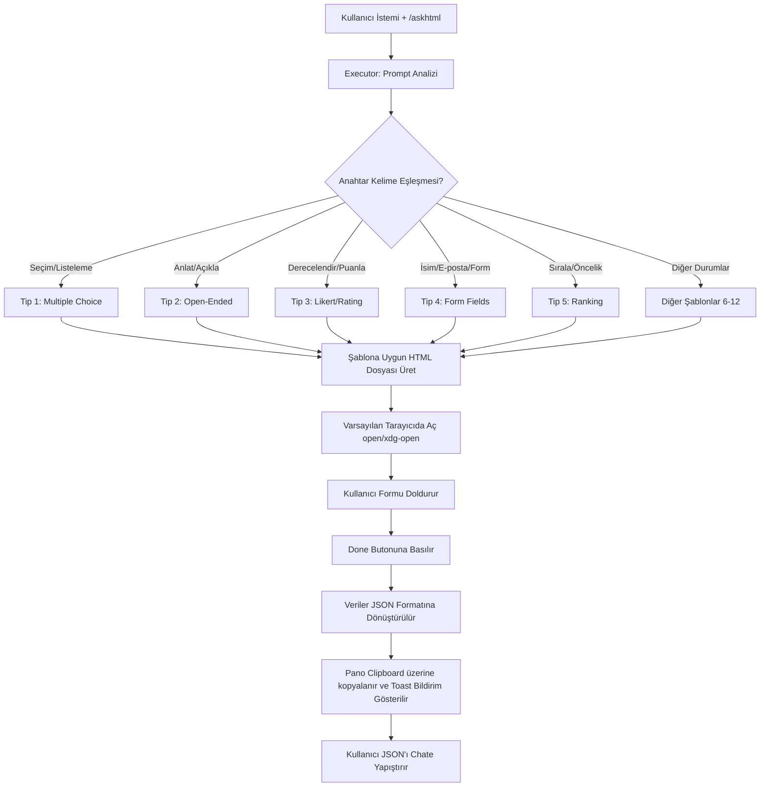

# 📋 AskHTML Detaylı Açıklama ve Kullanım Kılavuzu

`askhtml` yeteneği (skill), yapay zeka ile etkileşimlerinizde yapılandırılmış (structured) veri toplama süreçlerini tamamen değiştirmek ve hızlandırmak amacıyla tasarlanmıştır.

---

## 🎯 Amacı ve Çözdüğü Sorunlar

Yapay zeka modelleriyle çalışırken büyük veri listeleri, çoktan seçmeli tercihler, anketler veya karmaşık form verilerini doldurmak oldukça zahmetlidir. Sohbet satırına uzun uzun yazmak, imla hatalarına veya AI'ın formatı yanlış anlamasına yol açar.

**AskHTML bu sorunu nasıl çözer?**
- Sohbet arayüzünü geçici olarak **görsel bir web formuna** dönüştürür.
- Kullanıcıya hatasız, hızlı ve akıcı bir veri giriş deneyimi sunar.
- Form doldurulduğunda otomatik olarak panoya kopyalanan temiz bir **JSON** çıktısı üretir.
- Geliştiricinin veya AI modelinin doğrudan okuyabileceği standartta çıktı sağlar.

---

## 📊 Karşılaştırma: Standart Sohbet vs. AskHTML

| Özellik | Standart Sohbet Girişi | AskHTML Deneyimi |
| :--- | :--- | :--- |
| **Giriş Hızı** | Yavaş (her şeyi klavyeden yazmak gerekir) | Çok Hızlı (tıklamalar, kaydırma ve seçimler) |
| **Hata Payı** | Yüksek (imla hataları, eksik parametreler) | Sıfır (HTML form validasyonları ve şablonlar) |
| **Veri Yapısı** | Düz metin (AI'ın metni ayrıştırması gerekir) | Doğrudan yapılandırılmış JSON çıktısı |
| **Büyük Seçenek Setleri** | 50 seçeneği yazarak seçmek imkansızdır | Arama ve çoklu seçim arayüzleri ile saniyeler sürer |
| **Kullanıcı Arayüzü** | Monoton chat kutusu | AMOLED siyah temalı, modern ve şık mobil uyumlu UI |

---

## 🗺️ Çalışma Mantığı ve Akış Şeması

Aşağıdaki diyagramda `askhtml` yeteneğinin tetiklenmesinden JSON çıktısının alınmasına kadar olan süreç adım adım gösterilmiştir:



---

## 🛠️ Teknik Şablonlar ve JSON Yapıları

Sistem toplamda **12 farklı soru tipini** otomatik olarak algılayabilir:

### 1. Çoktan Seçmeli (Multiple Choice)
- **Tetikleyici kelimeler:** `choose`, `select`, `pick`, `option`, `list of`
- **Çıktı Formatı:**
  ```json
  {
    "selection": ["option_0", "option_2"]
  }
  ```

### 2. Açık Uçlu (Open-Ended)
- **Tetikleyici kelimeler:** `describe`, `explain`, `tell me`, `opinion`
- **Çıktı Formatı:**
  ```json
  {
    "response": "Kullanıcının detaylı açıklaması buraya gelir..."
  }
  ```

### 3. Likert / Derecelendirme (Likert Scale)
- **Tetikleyici kelimeler:** `rate`, `rating`, `satisfaction`, `1-5`, `scale`
- **Çıktı Formatı:**
  ```json
  {
    "rating": 4
  }
  ```

### 4. Form Alanları (Form Fields)
- **Tetikleyici kelimeler:** `name`, `email`, `phone`, `collect`, `contact`
- **Çıktı Formatı:**
  ```json
  {
    "name": "Ahmet Yılmaz",
    "email": "ahmet@example.com",
    "message": "Merhaba!"
  }
  ```

---

## 💡 İpuçları ve En İyi Pratikler

1. **Pop-up Engelleyiciler:** Form otomatik olarak tarayıcınızda yeni sekmede açılacaktır. Eğer açılmazsa tarayıcınızın pop-up engelleyicisini kontrol edin veya terminalde basılan dosya yolunu (`/tmp/askhtml_form_*.html`) manuel olarak açın.
2. **Klavye Navigasyonu:** Formlar erişilebilirlik standartlarına uygun olarak tasarlanmıştır. `Tab` ile alanlar arasında gezinebilir, seçenekleri seçebilir ve formu kolayca doldurabilirsiniz.
3. **Tekrar Gönderim:** Formda bir hata yaptıysanız, sekmeyi kapatmadan bilgileri güncelleyip tekrar **Done** butonuna basarak panonuzu güncelleyebilirsiniz.
